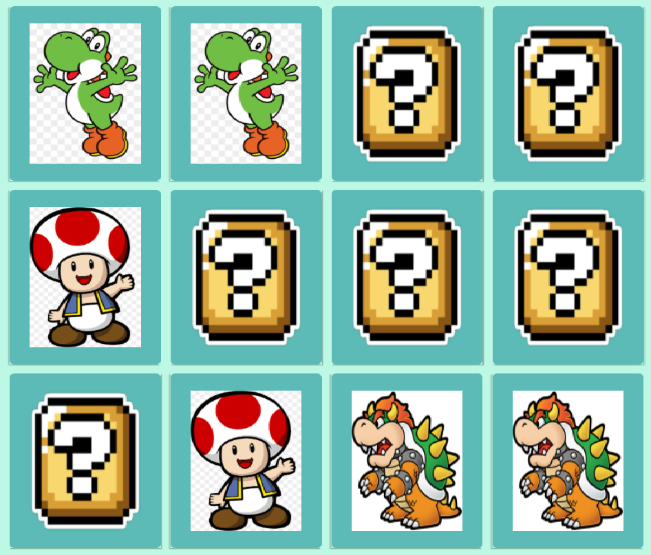

  

# Desenvolvendo um jogo da memória

Aula ministrada por Denilson Bonatti no curso da Digital Innovation One.

Fonte:
[Digital Innovation One(DIO)](https://digitalinnovation.one/)

## 🚀 Tecnologias

Esse projeto foi desenvolvido com as seguintes tecnologias:

* [HTML básico](https://www.w3schools.com/html/)
* [CSS básico](https://developer.mozilla.org/pt-BR/docs/Web/CSS)
* [JS básico](https://jquery.com)

<h4 align="center">
    Developed with ❤️ by <b>Douglas Rosa</b>
</h4>
